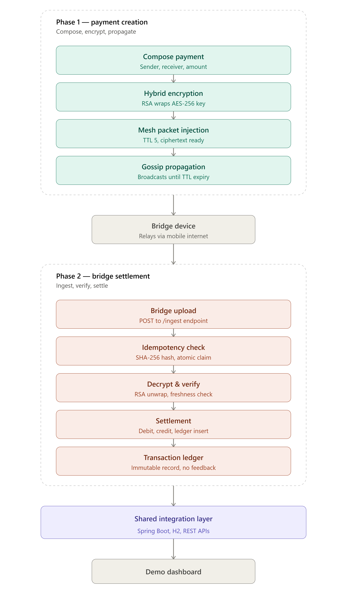

# MeshPay - Offline Payment Routing Simulation

## Overview

MeshPay is a Spring Boot based simulation of an offline-capable payment routing system built using mesh-network concepts.

The project demonstrates how encrypted transaction packets can still propagate across nearby devices even when internet connectivity is unavailable. Instead of failing immediately, packets are forwarded through virtual mesh nodes until one bridge node gets network access and uploads the transaction to the backend server for settlement.

This project focuses on:

* secure packet forwarding
* deferred transaction routing
* idempotent settlement handling
* encrypted transaction propagation
* distributed systems concepts

---

# Problem Statement

Traditional digital payment systems require active internet connectivity. In low-network environments such as:

* basements
* remote villages
* underground metros
* disaster zones
* crowded events

transactions usually fail immediately.

This project simulates an architecture where encrypted payment packets can continue travelling through nearby nodes until connectivity becomes available.

---

# Key Features

* Offline transaction routing simulation
* Mesh-network packet propagation
* Encrypted transaction packets
* RSA + AES-GCM hybrid encryption
* Duplicate transaction prevention using idempotency
* Concurrent-safe settlement handling
* Replay attack prevention using timestamp + nonce validation
* REST API based backend architecture
* Interactive dashboard for simulation

---

# Tech Stack

| Technology        | Usage                                     |
| ----------------- | ----------------------------------------- |
| Java 17           | Backend development                       |
| Spring Boot       | REST APIs & backend architecture          |
| H2 Database       | In-memory demo database                   |
| RSA Encryption    | Secure key exchange                       |
| AES-GCM           | Payload encryption + integrity validation |
| ConcurrentHashMap | Idempotency cache                         |
| Maven             | Dependency management                     |

---

# Project Flow

The following diagram illustrates the complete lifecycle of an offline payment packet—from transaction creation to secure settlement.

<p align="center">
 
</p>

### Flow Overview

1. **Compose Payment**
   - User selects sender, receiver, amount, and PIN.
   - A payment instruction is created.

2. **Hybrid Encryption**
   - AES-256-GCM encrypts the payment payload.
   - RSA-OAEP encrypts the AES session key.

3. **Mesh Packet Injection**
   - The encrypted payload is wrapped inside a mesh packet.
   - A Time-To-Live (TTL) value is assigned.

4. **Gossip Propagation**
   - Nearby virtual devices forward the encrypted packet.
   - Packets continue propagating until TTL expires or a bridge node receives them.

5. **Bridge Device**
   - When a bridge node regains internet connectivity, it uploads the packet to the backend.

6. **Idempotency Check**
   - The backend computes a SHA-256 hash of the ciphertext.
   - Duplicate packets are rejected using an atomic `putIfAbsent()` operation.

7. **Decrypt & Verify**
   - The backend decrypts the packet.
   - Freshness, integrity, and replay protection are verified.

8. **Settlement**
   - The sender is debited.
   - The receiver is credited.
   - A transaction record is inserted into the ledger.

9. **Transaction Ledger**
   - Every successful transaction is permanently recorded.
   - The mesh layer receives no settlement feedback in this simulation.

10. **Dashboard**
    - The dashboard visualizes balances, mesh devices, transactions, and activity logs in real time.

# Mesh Simulation

This project does not use real BLE hardware communication.

Instead, mesh networking is simulated using virtual device objects maintained in backend memory. During each gossip round, packets are propagated between nodes to simulate device-to-device forwarding.

---

# Security Mechanisms

## Hybrid Encryption

* RSA used for secure key exchange
* AES-GCM used for payload encryption

## Tamper Detection

AES-GCM authentication ensures modified packets are rejected.

## Replay Attack Prevention

Each packet contains:

* signed timestamp
* unique nonce

Old or replayed packets are automatically rejected.

---

# Idempotency Handling

To prevent duplicate settlements:

* SHA-256 hash generated from ciphertext
* Hash stored in idempotency cache
* Duplicate hashes rejected using atomic `putIfAbsent()` operation

This ensures:

```text
Same transaction → Processed only once
```

---

# Database Transactions

Spring Boot `@Transactional` annotation is used to ensure atomic settlement operations.

Meaning:

```text
Either all database updates succeed or all rollback
```

---

# API Endpoints

| Method | Endpoint             | Description                         |
| ------ | -------------------- | ----------------------------------- |
| POST   | `/api/demo/send`     | Inject transaction packet           |
| POST   | `/api/mesh/gossip`   | Run gossip round                    |
| POST   | `/api/mesh/flush`    | Upload packets through bridge nodes |
| POST   | `/api/bridge/ingest` | Backend settlement endpoint         |
| POST   | `/api/mesh/reset`    | Reset mesh and cache                |

---

# Running The Project

## Clone Repository

```bash
git clone https://github.com/2002Siddhesh/UPI_Without_Internet.git
cd MeshPay - Offline Payment Routing Simulation
```

## Run Application

### Windows

```cmd
.\mvnw.cmd spring-boot:run
```

### Linux / Mac

```bash
./mvnw spring-boot:run
```

---

# Open Dashboard

```text
http://localhost:8081
```

---

# Future Improvements

* Real BLE mesh communication
* Redis distributed caching
* PostgreSQL integration
* Real mobile device support
* Packet analytics dashboard
* Real-time node visualization

---

# Limitations

* Uses virtual nodes instead of real devices
* No real offline balance verification
* H2 in-memory database used for demo purposes
* Not production-ready banking infrastructure

---

# Learning Outcomes

This project helped in understanding:

* distributed systems concepts
* idempotency handling
* transaction consistency
* concurrency control
* hybrid encryption
* packet routing simulation
* backend API architecture

---

# Author

SIDDHESH SAWANT
